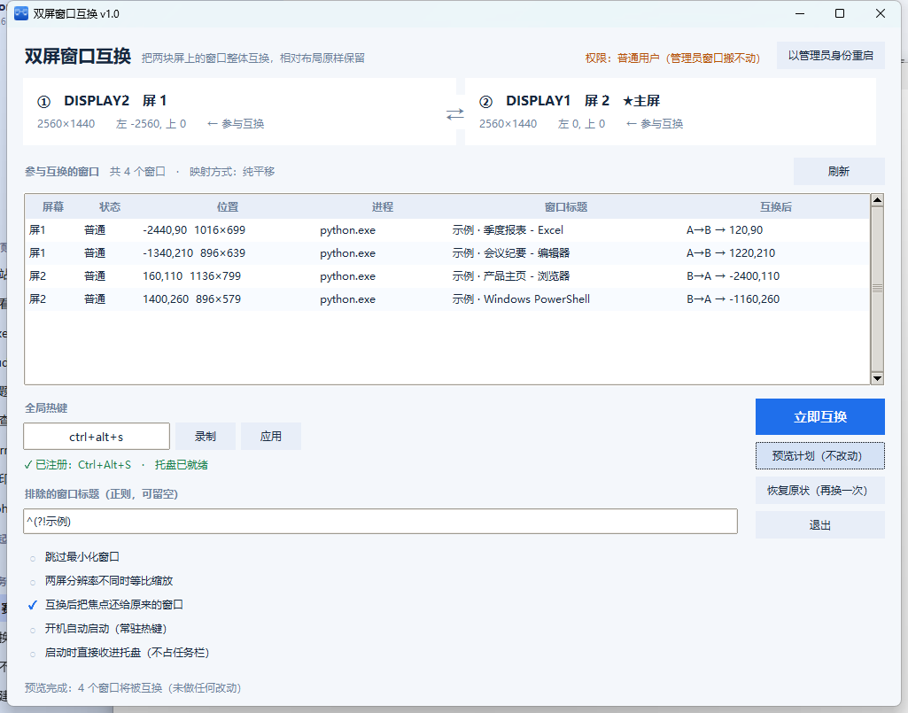

# 双屏窗口互换 · Swap Monitors

> 按一下热键，把两块显示器上的**所有窗口整体互换**，贴附好的布局原样保留。

左边屏的开发环境 ↔ 右边屏的浏览器和文档；把笔记本接上外接屏后，窗口全在错的那块屏上；
演示前想快速把「工作」和「演示」两组窗口对调……

拖一个窗口要 2 秒，拖十几个窗口要两分钟，还总有几个吸附位置对不齐。
这个工具把这件事变成**一次 Ctrl+Alt+S**。



---

## 特性

| | |
|---|---|
| **一键互换** | 全局热键（默认 `Ctrl+Alt+S`），任何窗口下都能按；也可以点界面上的按钮 |
| **布局真的不乱** | 只改窗口的矩形位置，**不动窗口状态**。最大化过去还是最大化，左右吸附过去还是左右吸附，相对位置逐像素对应 |
| **常驻托盘** | 点 `✕` 或最小化都收进**系统托盘**，不占任务栏；左键托盘图标唤回界面，右键可直接互换/退出 |
| **能搬动管理员窗口** | 普通权限搬不动以管理员身份运行的程序，界面里有一键「以管理员身份重启」；真遇到搬不动的窗口时会主动问你要不要提权 |
| **分辨率无关** | 两块屏尺寸一致时纯平移（不缩放、不丢像素）；不一致时自动等比缩放并夹进工作区。1920×1080 / 1440p / 4K / 带鱼屏 / 横排竖排都适用 |
| **零依赖** | 免安装单文件 exe，自带 Python 运行时；源码也只用 Python 标准库（`ctypes` + `tkinter`） |

---

## 下载

到 [**Releases**](https://github.com/DC1024/swap-monitors/releases/latest) 下载 `SwapMonitors.exe`，
双击即用，无需安装。

> 首次运行 Windows 可能提示「已保护你的电脑」（因为这是个人开发者签名缺失的 exe）。
> 点「更多信息」→「仍要运行」即可。程序不联网、不写注册表（除了开机自启这一项，你自己开才写）。

---

## 使用

### 图形界面

1. 打开 `SwapMonitors.exe`，上方两张卡片显示检测到的两块屏（`①` `②`，带 ★ 的是主屏）。
2. 决定哪两块屏参与互换：默认取前两块。下面表格列出当前会被互换的窗口、以及它们将落到哪里。
3. 按 `Ctrl+Alt+S`，或点 **立即互换**。

几个好用的按钮：

- **预览计划（不改动）** — 表格「互换后」列会填上目标位置，不做任何实际改动。第一次用建议先点这个。
- **恢复原状（再按一次）** — 其实就是再互换一次。映射是可逆的，换过去再换回来会**逐像素还原**。
- **以管理员身份重启** — 如果你有窗口搬不动（表格里进程列显示「（管理员进程）」），点它重新以管理员身份启动。

底部可以改：

| 选项 | 说明 |
|---|---|
| 全局热键 | 输入框直接写，或点「录制」按一遍组合键。填 `ctrl+alt+s` 这种写法 |
| 排除的窗口标题 | 正则。比如 `.*Steam.*` 就永远不动名字里有 Steam 的窗口 |
| 跳过最小化窗口 | 勾上则最小化的窗口留在原地 |
| 两屏分辨率不同时等比缩放 | 关掉就是纯平移（窗口可能超出屏幕边界） |
| 互换后把焦点还给原来的窗口 | 互换完不会把你正在打字的窗口抢到前台 |
| 开机自动启动（常驻热键） | 写一个启动项，开机就在托盘待命 |
| 启动时直接收进托盘（不占任务栏） | 配合上一项用 |

设置保存在 `%APPDATA%\SwapMonitors\config.json`，删掉这个文件即可恢复默认。

### 命令行

同一个 `swap_windows.py` 既是引擎也是 CLI，GUI 只是它的壳：

```bash
python swap_windows.py --list                 # 看看有哪些屏、哪些窗口会被换
python swap_windows.py --dry-run              # 只打印计划，不动任何窗口
python swap_windows.py                        # 真的换
python swap_windows.py --monitors 1,3         # 指定用哪两块屏（编号看 --list）
python swap_windows.py --only-title "记事本"   # 只动标题匹配的窗口
python swap_windows.py --skip-minimized       # 跳过最小化的窗口
python swap_windows.py --gui                  # 静默执行，只在失败时弹窗
```

| 参数 | 说明 |
|---|---|
| `--list` | 列出显示器与待交换窗口 |
| `--dry-run` | 只打印计划 |
| `--monitors 1,2` | 指定互换哪两块屏（默认前两块） |
| `--scale` | 分辨率不同时按比例缩放 |
| `--translate-only` | 强制纯平移 |
| `--exclude-title <正则>` | 额外排除的窗口标题 |
| `--only-title <正则>` | 只处理标题匹配的窗口 |
| `--only-proc <正则>` | 只处理进程名匹配的窗口 |
| `--exclude-pid 1,2` | 排除指定进程（GUI 用它排除自己） |
| `--skip-minimized` | 不处理最小化窗口 |
| `-v` / `-q` | 逐个打印结果 / 静默 |
| `--json` | 以 JSON 输出（GUI 消费这个） |
| `--gui` | 静默执行，失败时弹窗 |

---

## 它是怎么做到的

没有用任何私有 API，全是 Win32 的公开接口（`ctypes` 直接调，无第三方依赖）。

**1. 枚举窗口**

`EnumWindows` 拿到所有顶层窗口，再逐个过滤掉不该动的：不可见的、没有标题的、
`WS_EX_TOOLWINDOW` 的工具窗、被 DWM 隐藏的（`DWMWA_CLOAKED`，也就是其它虚拟桌面上的窗口）、
以及本程序自己。剩下的是「用户看得见、能拖动的窗口」。

**2. 判断每个窗口在哪块屏**

`MonitorFromWindow` 得到显示器句柄，`GetMonitorInfoW` 得到它的矩形。
注意**最小化窗口的矩形是 `(-32000, -32000)`** —— 所以对最小化窗口要改用
`GetWindowPlacement().rcNormalPosition` 的中心点来判断它属于哪块屏，否则会全部算错。

**3. 算新位置**

这是「布局不乱」的核心。设源屏矩形 `src`、目标屏矩形 `dst`：

```
尺寸相同 → 纯平移：      新位置 = 原位置 + (dst.left - src.left, dst.top - src.top)
尺寸不同 → 等比缩放：    sx = dst.w / src.w,  sy = dst.h / src.h
                        新位置 = dst 左上角 + (原位置 - src 左上角) × (sx, sy)
```

平移是可逆的整数加法，所以**换过去再换回来逐像素还原**，不会有累积误差。
缩放模式对 `sx`/`sy` 分别取整，来回换会有 1px 级别的误差，这是数学上不可避免的 —— 也正是
默认只在两块屏尺寸不同时才启用它的原因。

窗口若被换到工作区之外（比如换到一块更小的屏），会被**夹回**工作区范围内。

**4. 应用位置**

普通窗口直接 `SetWindowPos`。**最大化窗口要特殊处理**：单纯改 `WINDOWPLACEMENT` 里
`rcNormalPosition` 的话，`showCmd` 改了但窗口纹丝不动；必须走
`SetWindowPlacement(SW_SHOWNOACTIVATE)` → `SetWindowPos` → `ShowWindow(SW_MAXIMIZE)`
这三步，并且验证中心点确实落到了目标屏上（失败会重试一次）。

**5. 热键与托盘**

`RegisterHotKey` 注册全局热键，跑在一个带真消息泵的独立线程里。
托盘用 `Shell_NotifyIconW`；注意**消息专用窗口（`HWND_MESSAGE`）收不到托盘回调**，
所以这里建的是一个隐藏的普通顶层窗口。点 `✕` 时不是退出而是 `root.withdraw()`，
把界面藏起来、热键继续有效 —— 这也正是你在托盘里还能用热键的原因。

---

## 从源码运行

只需要 **Python 3.8+（Windows）**，GUI 需要自带 tkinter 的版本（python.org 的官方版都带）。
没有任何 pip 依赖。

```bash
python swap_gui.py            # 图形界面
python swap_windows.py --list # 命令行
```

## 自己打包 exe

```bash
build_exe.bat
```

脚本会找一个带 tkinter 的解释器，建虚拟环境装 PyInstaller，生成图标，最后产出
`dist\SwapMonitors.exe`。想指定解释器就设环境变量 `SWAPMONITORS_PY`。

> 建议以纯 ASCII 保存这个 bat —— `cmd.exe` 用 OEM 代码页读批处理文件，
> 非 ASCII 字符在部分环境下会让解析出错。

## 自测

```bash
python tests/test_map.py              # 映射逻辑与分辨率无关（纯数学，任何机器可跑）
python tests/test_selftest.py         # 造真实窗口跑一遍互换 + 校验最大化/最小化（需两块屏）
python tests/verify_gui.py --hotkey --tray   # 启动 GUI，发真热键，点 ✕，校验托盘
python tests/demo_windows.py          # 摆几个「示例」窗口，方便截图
```

`test_selftest.py` 和 `verify_gui.py` 会**真的移动窗口**，跑之前先把手头的事情存一下。
`verify_gui.py` 用独立的临时配置（`SWAPMONITORS_CONFIG` 环境变量注入），不会动你的真实设置。

---

## 已知限制

- **只支持 Windows。** 全是 Win32 API，没有跨平台计划（macOS 侧有现成的工具，Linux 看你的 WM）。
- **管理员窗口需要提权。** 这是 Windows 的 UIPI（用户界面特权隔离）限制：普通进程不能移动
  更高完整性级别进程的窗口。程序里给了提权入口，但要不要提权、什么时候提权由你决定。
- **虚拟桌面的窗口会被跳过。** 用 DWM cloaked 状态判定，不会把你在另一个虚拟桌面上的窗口拽过来。
- **UWP 应用可能不听话。** 部分 UWP 窗口由 `ApplicationFrameHost` 托管，位置由系统管，可能搬不动。
- 目前一次只处理**两块**屏。三四块屏的场景没做（`--monitors 1,3` 可以先指定要动哪两块）。

## 许可

[MIT](LICENSE)

---

## English

**Swap Monitors** — swap every window between two monitors with one hotkey
(`Ctrl+Alt+S` by default), keeping snapped layouts intact.

It moves windows by rectangle, not by state, so a maximized window stays maximized and a
snapped window stays snapped. Same-size monitors are handled as a pure integer translation
(fully reversible, pixel-exact); mismatched sizes fall back to proportional scaling.
Runs in the system tray, can relaunch itself elevated to move admin-owned windows, and has
zero third-party dependencies — the `ctypes` + `tkinter` source is ~1.5k lines of Python.

Windows only. Download `SwapMonitors.exe` from
[Releases](https://github.com/DC1024/swap-monitors/releases/latest).
